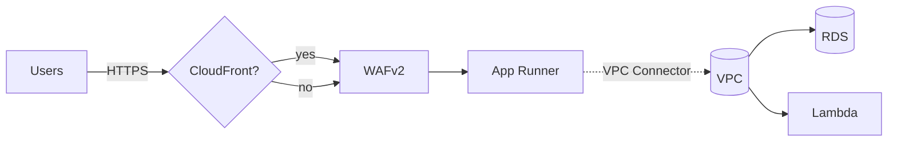

# AWS Infrastructure as Code with Pulumi

A cost-optimized, reliable AWS infrastructure setup using Pulumi TypeScript for deploying applications with App Runner, PostgreSQL database, and Lambda functions.

## Architecture Overview

This infrastructure follows AWS Well-Architected Framework principles with focus on:

- **Cost Optimization**: Right-sized instances, auto-scaling, and pay-per-request models
- **Reliability**: Multi-AZ database, automated backups, comprehensive monitoring
- **Operational Excellence**: Infrastructure as Code, automated CI/CD, monitoring dashboards

For visuals, see docs/ARCHITECTURE.md.

### Components

- **App Runner**: Main application hosting with GitHub integration and VPC connectivity
    - Public ingress enabled; WAF protection attached in production by default
    - Private egress to VPC resources via VPC Connector (e.g., RDS)
- **RDS PostgreSQL**: Managed database with automatic backups
- **Lambda Functions**: Serverless functions for background tasks
- **CloudWatch**: Monitoring, alerting, and dashboards
- **Cost Management**: Budgets, anomaly detection, and cost optimization

### Diagram (High-Level)



## Project Structure

```
pulumi-infrastructure/
├── environments/          # Environment-specific configurations
│   ├── dev/              # Development environment
│   ├── staging/          # Staging environment
│   └── prod/             # Production environment
├── modules/              # Reusable infrastructure modules
│   ├── networking/       # VPC, subnets, routing
│   ├── database/         # RDS PostgreSQL
│   ├── compute/          # App Runner services
│   ├── lambda/           # Lambda functions
│   └── monitoring/       # CloudWatch, alarms, budgets
├── shared/               # Shared configuration and types
├── .github/workflows/    # CI/CD pipeline
└── docs/                 # Additional documentation
```

## Quick Start

### Prerequisites

1. **AWS Account**: Active AWS account with appropriate permissions
2. **AWS CLI**: [Install and configure AWS CLI](https://docs.aws.amazon.com/cli/latest/userguide/getting-started-install.html)
3. **Pulumi**: [Install Pulumi CLI](https://www.pulumi.com/docs/install/)
4. **Node.js**: Version 22 or later
5. **GitHub Repository**: For App Runner source integration

### 1. Setup

```bash
# Clone the repository
git clone <your-repo-url>
cd pulumi-infrastructure

# Install dependencies
npm install

# Build TypeScript
npm run build
```

### 2. Configure Pulumi

```bash
# Login to Pulumi (create free account if needed)
pulumi login

# Create stacks for each environment
pulumi stack init dev --cwd environments/dev
pulumi stack init staging --cwd environments/staging
pulumi stack init prod --cwd environments/prod
```

### 3. Environment Configuration

#### Development Environment

```bash
cd environments/dev

# Set required configuration
pulumi config set appName "your-app-name"
pulumi config set repositoryUrl "https://github.com/username/your-repo"
pulumi config set --secret dbPassword "your-secure-password"
pulumi config set alertEmail "your-email@example.com"

# Optional configuration
pulumi config set branch "develop"
pulumi config set apiBaseUrl "https://api.example.com"
```

#### Staging Environment

```bash
cd ../staging

# Set configuration for staging
pulumi config set appName "your-app-name"
pulumi config set repositoryUrl "https://github.com/username/your-repo"
pulumi config set --secret dbPassword "your-staging-password"
pulumi config set alertEmail "your-email@example.com"
```

#### Production Environment

```bash
cd ../prod

# Set configuration for production
pulumi config set appName "your-app-name"
pulumi config set repositoryUrl "https://github.com/username/your-repo"
pulumi config set --secret dbPassword "your-production-password"
pulumi config set alertEmail "your-email@example.com" # REQUIRED for production

# Production-specific settings
pulumi config set enableNewFeature false
pulumi config set sentryDsn "your-sentry-dsn" # Optional
```

### 4. Deploy Infrastructure

#### Development (First Deployment)

```bash
cd environments/dev
pulumi up
```

#### Staging

```bash
cd environments/staging
pulumi up
```

#### Production

```bash
cd environments/prod
pulumi preview  # Always preview production changes first
pulumi up       # Deploy after review
```

## Cost Optimization Features

### Development Environment

- **Database**: `db.t3.micro` (~$13/month)
- **App Runner**: Scales to zero, pay-per-request
- **Lambda**: 128MB memory, minimal timeout
- **Storage**: 20GB with auto-scaling to 50GB
- **Estimated Cost**: ~$20–$35/month

### Staging Environment (lean)

- **Networking**: Single AZ, fck‑nat enabled, no NAT Gateway baseline
- **Database**: `db.t4g.micro`, 20 GB gp3 (auto up to 50 GB)
- **App Runner**: 0.25 vCPU / 0.5 GB, minSize 0, maxSize 2, maxConcurrency ~10
- **Lambda**: 128 MB
- **WAF/CloudFront**: Off by default (can be enabled for testing)
- **Estimated Cost**: ~$30–$60/month (mostly idle)

### Production Environment

- **Database**: `db.t4g.small` Multi-AZ (~$58/month)
- **App Runner**: Optimized concurrency and scaling
- **Lambda**: Right-sized memory allocation
- **Backups**: Automated with lifecycle policies
- **Estimated Cost**: $80-120/month

### Cost Monitoring

- Monthly budgets with 80% and 100% alerts
- Cost anomaly detection
- Resource tagging for cost allocation

## Monitoring & Observability

### CloudWatch Dashboards

Each environment includes dashboards monitoring:

- App Runner: Request count, response time, active instances
- RDS: CPU utilization, connections, storage
- Lambda: Duration, errors, throttles
- Costs: Estimated charges and budget status

### Alerts

Staging and production include alerts; production uses tighter SLOs:

- SLOs: App Runner p95 response time (>1s), 5xx error rate (>1%)
- SLOs: Lambda p95 duration (>1s), error rate (>1%)
- Database CPU (>80%)
- Storage space (<2GB free)
- Lambda throttles and high error counts

## Security Best Practices

### Database Security

- Private subnets only
- Security groups with minimal access
- Encryption at rest enabled
- Automated backups with point-in-time recovery

- App Runner runs inside your VPC via a VPC Connector; public ingress, private egress via SGs
- Lambdas run in private subnets with scoped SGs to reach RDS when needed
- IAM roles scoped to minimum required actions (logs access limited to function log groups; X-Ray only for App Runner)
- Runtime secrets via SSM Parameter Store (optional) with IAM limited to specified parameter paths
- WAFv2 WebACL attached to App Runner (prod by default); optional CloudFront in front for edge protections and caching

### Network Security

- VPC with public/private subnet separation
- Egress via NAT/fck‑nat and/or VPC endpoints for outbound access
- Security groups instead of NACLs for simplicity

## CI/CD Pipeline

### GitHub Actions

- `.github/workflows/ci.yml` runs TypeScript build and unit tests on PRs and on pushes to `main`/`master`.
- Add a separate deploy workflow if you want automated `pulumi up` on merges; this repo intentionally keeps deploy manual.

Required secrets for a deploy workflow (if you add one): `AWS_ACCESS_KEY_ID`, `AWS_SECRET_ACCESS_KEY`, `PULUMI_ACCESS_TOKEN`.

## Environment Differences

| Feature             | Development | Staging (lean) | Production   |
| ------------------- | ----------- | -------------- | ------------ |
| Database Instance   | db.t3.micro | db.t4g.micro   | db.t4g.small |
| Multi-AZ            | No          | No             | Yes          |
| App Runner Min Size | 0           | 0              | 1            |
| App Runner Max Size | 2           | 2              | 5            |
| CPU/Memory          | 0.25/0.5    | 0.25/0.5       | 0.5/1        |
| NAT/fck‑nat         | fck‑nat     | fck‑nat        | NAT          |
| Backup Retention    | 1 day       | 1 day          | 7 days       |
| Monitoring          | Basic       | Basic          | Full         |
| Cost Budget         | $50/month   | $50/month      | $200/month   |

## Customization

### Adding Lambda Functions

1. **Create function in Lambda module**:

```typescript
const newLambda = lambdaGroup.addFunction(`${appName}-new-function`, {
    name: `${appName}-new-function`,
    environment: environment,
    runtime: "nodejs22.x",
    handler: "index.handler",
    code: new pulumi.asset.AssetArchive({
        "index.js": new pulumi.asset.StringAsset(`
            exports.handler = async (event) => {
                // Your function logic
                return { statusCode: 200, body: "Success" };
            };
        `),
    }),
    environmentVariables: {
        DATABASE_URL: database.getConnectionString(),
    },
});
```

2. **Add to monitoring**:

```typescript
lambdaFunctionNames: [
    `${appName}-example-${environment}`,
    `${appName}-new-function-${environment}`, // Add this line
],
```

### Modifying App Runner Configuration

Edit the App Runner configuration in each environment:

```typescript
// In environments/{env}/index.ts
const appService = new AppRunnerService(`${appName}-${environment}-app`, {
    // Modify these values as needed
    maxConcurrency: 25,
    maxSize: 5,
    minSize: 1,
    cpu: "1 vCPU", // Upgrade if needed
    memory: "2 GB", // Upgrade if needed
});
```

## Maintenance Tasks

### Regular Tasks

- **Weekly**: Review cost dashboard and optimize resources
- **Monthly**: Update dependencies and Pulumi version
- **Quarterly**: Review and test disaster recovery procedures

### Database Maintenance

- Monitor storage usage and adjust auto-scaling limits
- Review query performance with Performance Insights
- Test backup restoration procedures

### Security Updates

- Regularly update base images for Lambda functions
- Review IAM permissions and remove unused roles
- Monitor security alerts in AWS Security Hub

## Troubleshooting

### Common Issues

#### App Runner Deployment Fails

```bash
# Check App Runner logs
aws apprunner list-services
aws apprunner describe-service --service-arn <service-arn>

# Check GitHub connection
cd environments/<env>
pulumi stack output connectionArn
```

#### Database Connection Issues

```bash
# Test database connectivity
cd environments/<env>
pulumi stack output databaseEndpoint

# Check security groups
pulumi stack output dbSecurityGroupId
aws ec2 describe-security-groups --group-ids $(pulumi stack output dbSecurityGroupId)
```

#### Lambda Function Errors

```bash
# View Lambda logs
aws logs describe-log-groups --log-group-name-prefix /aws/lambda/

# Check function configuration
pulumi stack output exampleLambdaArn
```

### Getting Help

- Check AWS CloudWatch logs for detailed error messages
- Review Pulumi state with `pulumi stack --show-ids`
- Use AWS CLI to inspect resources directly

## Disaster Recovery

### Database Recovery

1. **Point-in-time Recovery**: Available for last 7 days
2. **Automated Snapshots**: Daily snapshots with 7-day retention
3. **Cross-region Backups**: Optional; not configured by default

### Application Recovery

1. **App Runner**: Automatically handles instance failures
2. **Lambda**: Built-in fault tolerance and retries
3. **Infrastructure**: Recreate from Pulumi code

## Scaling Considerations

### Horizontal Scaling

- App Runner: Increase `maxSize` and `maxConcurrency`
- Lambda: Increase `reservedConcurrentExecutions`
- Database: Add read replicas for read-heavy workloads

### Vertical Scaling

- Database: Upgrade to larger instance class
- App Runner: Increase CPU/memory allocation
- Lambda: Increase memory allocation

### Cost vs Performance Trade-offs

- Monitor CloudWatch metrics before scaling decisions
- Use cost calculator to estimate scaling costs
- Consider reserved instances for predictable workloads

---

## Support

For questions or issues:

1. Check this documentation first
2. Review CloudWatch logs and metrics
3. Consult AWS documentation
4. Create GitHub issue for infrastructure problems

## License

This project is licensed under the MIT License - see the LICENSE file for details.

### Runtime Secrets with SSM Parameter Store

1. Create parameters (SecureString) in SSM, e.g.:

```
aws ssm put-parameter --name /app/<appName>/<env>/DATABASE_URL --type SecureString --value 'postgres://...'
```

2. Grant read access by passing allowed paths when creating resources:

```typescript
const appService = new AppRunnerService(`${appName}-${environment}-app`, {
    // ...
    ssmParameterPaths: [`/app/${appName}/${environment}/`], // enables ssm:GetParameter(s) on this prefix
});

const myLambda = lambdaGroup.addFunction(`${appName}-${environment}-worker`, {
    // ...
    ssmParameterPaths: [`/app/${appName}/${environment}/`],
});
```

3. Read parameters in your app at runtime using the AWS SDK.

### Enabling WAF and CloudFront

- WAF (App Runner): enabled by default in production. To override per environment:

```
pulumi config set enableWaf true   # or false
```

- CloudFront (optional): place a distribution in front of App Runner for edge protections/caching:

```
pulumi config set enableCloudFront true
```

Stack outputs will include `wafArn` and `cloudFrontDomainName` when enabled.
