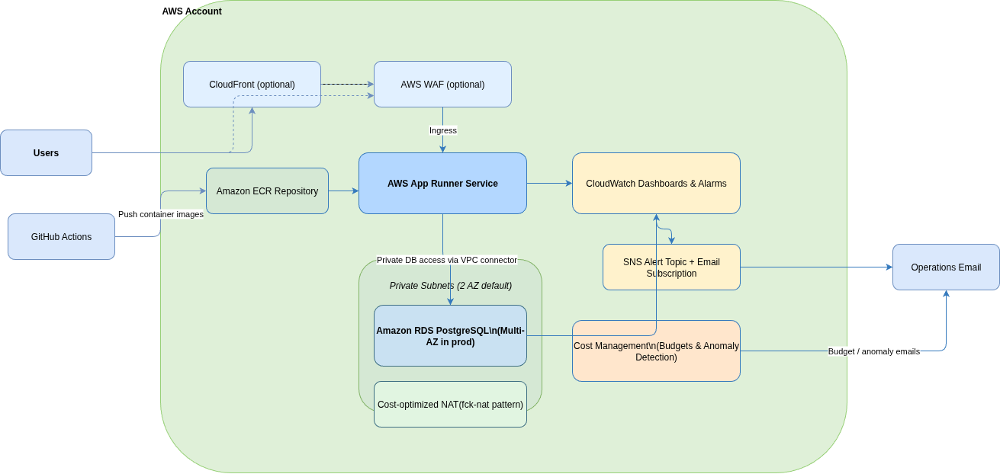
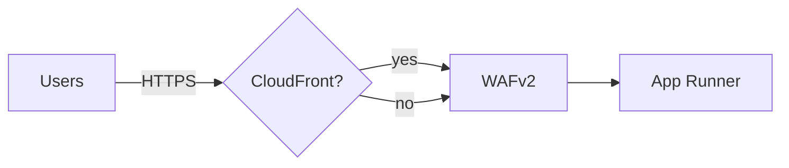

# AWS Infrastructure as Code with Pulumi

A cost-optimized, reliable AWS infrastructure setup using Pulumi TypeScript for deploying applications with App Runner and a PostgreSQL database.

## Architecture Overview

This infrastructure follows AWS Well-Architected Framework principles with focus on:

- **Cost Optimization**: Right-sized instances, auto-scaling, and pay-per-request models
- **Reliability**: Multi-AZ database, automated backups, comprehensive monitoring
- **Operational Excellence**: Infrastructure as Code, automated CI/CD, monitoring dashboards

For visuals, see docs/ARCHITECTURE.md.



### Components

- **App Runner**: Main application hosting with GitHub integration and VPC connectivity
    - Public ingress enabled; WAF protection attached in production by default
    - Private egress to VPC resources via VPC Connector (e.g., RDS)
- **RDS PostgreSQL**: Managed database with automatic backups
- **CloudWatch**: Monitoring, alerting, and dashboards
- **Cost Management**: Budgets, anomaly detection, and cost optimization

### Diagram (High-Level)



## Project Structure

pulumi-iac-aws/
├── environments/ # Environment-specific configurations
│ ├── dev/ # Development environment
│ ├── staging/ # Staging environment
│ └── prod/ # Production environment
├── modules/ # Reusable infrastructure modules
│ ├── networking/ # VPC, subnets, routing
│ ├── database/ # RDS PostgreSQL
│ ├── compute/ # App Runner services
│ └── monitoring/ # CloudWatch, alarms, budgets
├── shared/ # Shared configuration and types
├── .github/workflows/ # CI/CD pipeline
└── docs/ # Additional documentation

````

## Setup Resources

### setup-files

- Houses reusable templates referenced during onboarding (e.g., `deploy.yml` for GitHub Actions, baseline IAM policies).
- None of these templates are consumed directly by Pulumi—copy them into your GitHub repository or IAM workflows and tailor as needed.

### setup-scripts

- Shell utilities that bootstrap IAM users, validate prerequisites, deploy stacks, and configure GitHub Actions secrets.
- Start with `interactive-setup.sh` for a guided flow or run `validate-setup.sh`, `create-iac-user.sh`, and `get-github-vars.sh` individually.
- See `setup-scripts/README.md` for prerequisites, sample commands, and troubleshooting guidance.

## Quick Start

### Prerequisites

1. **AWS Account**: Active AWS account with appropriate permissions
2. **AWS CLI**: [Install and configure AWS CLI](https://docs.aws.amazon.com/cli/latest/userguide/getting-started-install.html)
3. **Pulumi**: [Install Pulumi CLI](https://www.pulumi.com/docs/install/)
4. **Node.js**: Version 22 or later
5. **Docker**: For building container images for App Runner
6. **GitHub Repository**: Used by CI/CD to build and push container images

### 1. Setup

```bash
# Clone the repository
git clone <your-repo-url>
cd pulumi-iac-aws

# Install dependencies
npm install

# Build TypeScript
npm run build
````

### 2. Configure Pulumi

```bash
# Login to Pulumi (create free account if needed)
pulumi login

# Create stacks for each environment
pulumi stack init dev --cwd environments/dev
pulumi stack init staging --cwd environments/staging
pulumi stack init prod --cwd environments/prod
```

### 3. Environment Configuration

#### Development Environment

```bash
cd environments/dev

# Set required configuration
pulumi config set appName "your-app-name"
pulumi config set githubOrg "your-github-org"
pulumi config set githubRepo "your-service-repo"
pulumi config set --secret dbPassword "your-secure-password"
pulumi config set alertEmail "your-email@example.com"

# Optional configuration
pulumi config set apiBaseUrl "https://api.example.com"
```

#### Staging Environment

```bash
cd ../staging

# Set configuration for staging
pulumi config set appName "your-app-name"
pulumi config set githubOrg "your-github-org"
pulumi config set githubRepo "your-service-repo"
pulumi config set --secret dbPassword "your-staging-password"
pulumi config set alertEmail "your-email@example.com"
```

#### Production Environment

```bash
cd ../prod

# Set configuration for production
pulumi config set appName "your-app-name"
pulumi config set githubOrg "your-github-org"
pulumi config set githubRepo "your-service-repo"
pulumi config set --secret dbPassword "your-production-password"
pulumi config set alertEmail "your-email@example.com" # REQUIRED for production

# Production-specific settings
pulumi config set enableNewFeature false
pulumi config set sentryDsn "your-sentry-dsn" # Optional
```

### 4. Deploy Infrastructure

#### Development (First Deployment)

```bash
cd environments/dev
pulumi up
```

#### Staging

```bash
cd environments/staging
pulumi up
```

#### Production

```bash
cd environments/prod
pulumi preview  # Always preview production changes first
pulumi up       # Deploy after review
```

## Cost Optimization Features

### Development Environment

- **Database**: `db.t3.micro` (~$13/month)
- **App Runner**: Scales to zero, pay-per-request
- **Storage**: 20GB with auto-scaling to 50GB
- **Estimated Cost**: ~$20–$35/month

### Staging Environment (lean)

- **Networking**: Single AZ, fck‑nat enabled, no NAT Gateway baseline
- **Database**: `db.t4g.micro`, 20 GB gp3 (auto up to 50 GB)
- **App Runner**: 0.25 vCPU / 0.5 GB, minSize 0, maxSize 2, maxConcurrency ~10
- **WAF/CloudFront**: Off by default (can be enabled for testing)
- **Estimated Cost**: ~$30–$60/month (mostly idle)

### Production Environment

- **Database**: `db.t4g.small` Multi-AZ (~$58/month)
- **App Runner**: Optimized concurrency and scaling
- **Backups**: Automated with lifecycle policies
- **Estimated Cost**: $80-120/month

### Cost Monitoring

- Monthly budgets with 80% and 100% alerts
- Cost anomaly detection
- Resource tagging for cost allocation

## Monitoring & Observability

### CloudWatch Dashboards

Each environment includes dashboards monitoring:

- App Runner: Request count, response time, active instances
- RDS: CPU utilization, connections, storage
- Costs: Estimated charges and budget status

### Alerts

Staging and production include alerts; production uses tighter SLOs:

- SLOs: App Runner p95 response time (>1s), 5xx error rate (>1%)
- Database CPU (>80%)
- Storage space (<2GB free)

## Security Best Practices

### Database Security

- Private subnets only
- Security groups with minimal access
- Encryption at rest enabled
- Automated backups with point-in-time recovery

- App Runner runs inside your VPC via a VPC Connector; public ingress, private egress via SGs
- IAM roles scoped to minimum required actions (logs access limited to function log groups; X-Ray only for App Runner)
- Runtime secrets via SSM Parameter Store (optional) with IAM limited to specified parameter paths
- WAFv2 WebACL attached to App Runner (prod by default); optional CloudFront in front for edge protections and caching

### Network Security

- VPC with public/private subnet separation
- Egress via NAT/fck‑nat and/or VPC endpoints for outbound access
- Security groups instead of NACLs for simplicity

## CI/CD Pipeline

### GitHub Actions

- `.github/workflows/ci.yml` runs TypeScript build and unit tests on PRs and on pushes to `main`/`master`.
- Add a separate deploy workflow if you want automated `pulumi up` on merges; this repo intentionally keeps deploy manual.

Required secrets for a deploy workflow (if you add one): `AWS_ACCESS_KEY_ID`, `AWS_SECRET_ACCESS_KEY`, `PULUMI_ACCESS_TOKEN`.

## Environment Differences

| Feature             | Development | Staging (lean) | Production   |
| ------------------- | ----------- | -------------- | ------------ |
| Database Instance   | db.t3.micro | db.t4g.micro   | db.t4g.small |
| Multi-AZ            | No          | No             | Yes          |
| App Runner Min Size | 0           | 0              | 1            |
| App Runner Max Size | 2           | 2              | 5            |
| CPU/Memory          | 0.25/0.5    | 0.25/0.5       | 0.5/1        |
| NAT/fck‑nat         | fck‑nat     | fck‑nat        | NAT          |
| Backup Retention    | 1 day       | 1 day          | 7 days       |
| Monitoring          | Basic       | Basic          | Full         |
| Cost Budget         | $50/month   | $50/month      | $200/month   |

## Customization

### Modifying App Runner Configuration

Edit the App Runner configuration in each environment:

```typescript
// In environments/{env}/index.ts
const appService = new AppRunnerService(`${appName}-${environment}-app`, {
    // Modify these values as needed
    maxConcurrency: 25,
    maxSize: 5,
    minSize: 1,
    cpu: "1 vCPU", // Upgrade if needed
    memory: "2 GB", // Upgrade if needed
});
```

### Modifying Database Configuration

Edit the RDS configuration in each environment:

```typescript
// In environments/{env}/index.ts
const dbInstance = new rds.Instance(`${appName}-${environment}-db`, {
    instanceClass: "db.t4g.small", // Upgrade if needed
    allocatedStorage: 20, // Increase if needed
    maxAllocatedStorage: 100, // Increase if needed
    backupRetentionPeriod: 7, // Adjust as needed
});
```

## Maintenance Tasks

### Regular Tasks

- **Weekly**: Review cost dashboard and optimize resources
- **Monthly**: Update dependencies and Pulumi version
- **Quarterly**: Review and test disaster recovery procedures

### Database Maintenance

- Monitor storage usage and adjust auto-scaling limits
- Review query performance with Performance Insights
- Test backup restoration procedures

### Security Updates

- Review IAM permissions and remove unused roles
- Monitor security alerts in AWS Security Hub

## Troubleshooting

### Common Issues

#### App Runner Deployment Fails (normally in the 1st deploy because ECR repo will be empty)

```bash
# Check App Runner logs
aws apprunner list-services
aws apprunner describe-service --service-arn <service-arn>

# Confirm a container image is available in ECR
aws ecr describe-images --repository-name <repository-name>
```

### Getting Help

- Check AWS CloudWatch logs for detailed error messages
- Review Pulumi state with `pulumi stack --show-ids`
- Use AWS CLI to inspect resources directly

## Disaster Recovery

### Database Recovery

1. **Point-in-time Recovery**: Available for last 7 days
2. **Automated Snapshots**: Daily snapshots with 7-day retention
3. **Cross-region Backups**: Optional; not configured by default

### Application Recovery

1. **App Runner**: Automatically handles instance failures
2. **Infrastructure**: Recreate from Pulumi code

### Vertical Scaling

- Database: Upgrade to larger instance class
- App Runner: Increase CPU/memory allocation

### Horizontal Scaling

- App Runner: Adjust min/max size and concurrency settings
- Database: Scale storage automatically; consider read replicas for read-heavy workloads

### Cost vs Performance Trade-offs

- Monitor CloudWatch metrics before scaling decisions
- Use cost calculator to estimate scaling costs
- Consider reserved instances for predictable workloads

---

### Enabling WAF and CloudFront

- WAF (App Runner): enabled by default in production. To override per environment:

```bash
pulumi config set enableWaf true   # or false
```

- CloudFront (optional): place a distribution in front of App Runner for edge protections/caching:

```bash
pulumi config set enableCloudFront true
```

```bash
pulumi config set enableWaf true   # or false
```

- CloudFront (optional): place a distribution in front of App Runner for edge protections/caching:

```bash
pulumi config set enableCloudFront true
```

```bash
pulumi config set enableCloudFront true
```
