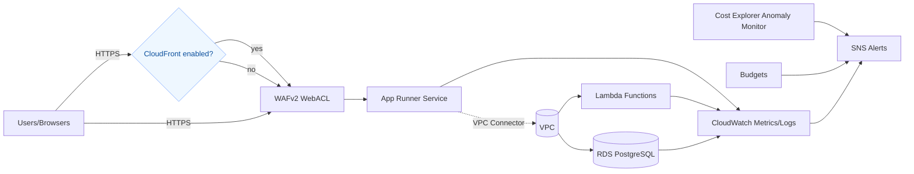
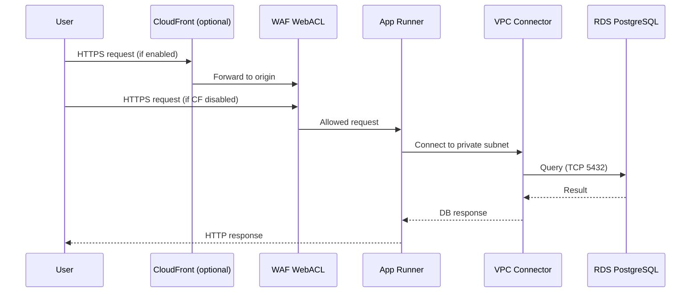

# Architecture Diagrams

This document illustrates the current architecture for dev, staging, and prod, including public App Runner ingress, VPC egress to private resources, and cost/monitoring components.

## High-Level



Notes

- Public ingress terminates at App Runner; WAF is attached in production by default.
- App Runner uses a VPC Connector for private egress to RDS.
- Lambda functions run in the VPC, typically in private subnets.

## Networking: Dev/Staging (Lean)

```mermaid
flowchart TB
  subgraph VPC[ VPC (10.1.0.0/24) ]
    direction LR
    subgraph Public[Public Subnet]
      IGW[Internet Gateway]
      FCK[fck-nat (t4g.nano)]
      PublicRT[Public RT: 0.0.0.0/0 -> IGW]
    end

    subgraph Private[Private Subnet]
      RDS[(RDS)]
      ENIs[Lambda ENIs]
      PrivateRT[Private RT: 0.0.0.0/0 -> fck-nat]
    end
  end

  U[Users] --> WAF[(WAF optional)] --> AR[App Runner]
  AR -. VPC Connector .-> Private

  %% Security groups
  ARSG[[App Runner SG]] -. allows 5432 .-> RDS
  LSG[[Lambda SG]] -. allows 5432 .-> RDS
```

Notes

- Staging mirrors dev sizing: single AZ, fck‑nat (no NAT Gateway baseline), App Runner scales to zero.
- RDS single-AZ in dev/staging.

## Networking: Production

```mermaid
flowchart TB
  subgraph VPC[ VPC (10.2.0.0/24) ]
    direction LR
    subgraph PublicA[Public Subnet A]
      IGW[Internet Gateway]
      NATa[NAT Gateway A]
      PublicRTA[RT A: 0.0.0.0/0 -> IGW]
    end

    subgraph PrivateA[Private Subnet A]
      RDSP[(RDS - Multi-AZ)]
      LambdaA[Lambda ENIs A]
      PrivateRTA[RT A: 0.0.0.0/0 -> NATa]
    end

    subgraph PublicB[Public Subnet B]
      NATb[NAT Gateway B]
      PublicRTB[RT B: 0.0.0.0/0 -> IGW]
    end

    subgraph PrivateB[Private Subnet B]
      LambdaB[Lambda ENIs B]
      PrivateRTB[RT B: 0.0.0.0/0 -> NATb]
    end
  end

  U[Users] --> CF{CloudFront enabled?}
  CF -- yes --> WAF[WAFv2 WebACL]
  CF -- no  --> WAF
  WAF --> AR[App Runner]
  AR -. VPC Connector .-> PrivateA
  AR -. VPC Connector .-> PrivateB

  %% Security groups
  ARSG[[App Runner SG]] -. allows 5432 .-> RDSP
  LSG[[Lambda SG]] -. allows 5432 .-> RDSP
```

Notes

- NAT Gateways per AZ; RDS Multi-AZ enabled.
- WAF is enabled by default; CloudFront is optional and can front App Runner.

## Request Flow



## Security Boundaries

- App Runner is internet-facing; WAF protects ingress (prod default).
- RDS SG only allows ingress from App Runner SG and Lambda SG.
- IAM roles are scoped: App Runner ECR pull + X-Ray; Lambda logs limited to function group; optional SSM read on specified paths.

## Monitoring & Cost

- CloudWatch dashboards and alarms (SLO-focused: p95 latency, error rates).
- AWS Budgets and Cost Explorer Anomaly Monitor send notifications to SNS/email.
