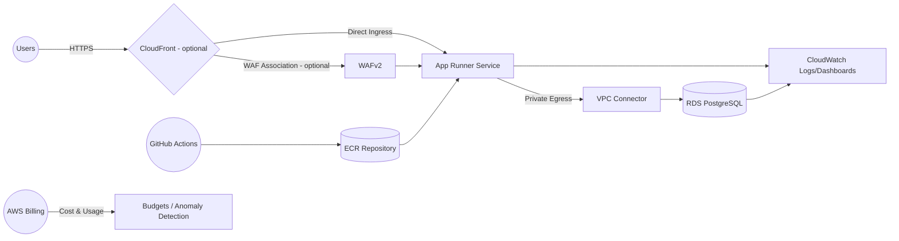

# AWS Infrastructure Architecture

## Objectives

- Deliver a repeatable Pulumi TypeScript blueprint for App Runner–centric applications.
- Balance cost optimisation with operational resilience across dev, staging, and prod stacks.
- Keep environment parity via shared modules while allowing guarded production-only controls (WAF, multi-AZ RDS, DLQs).

## High-Level Flow

## Environments & Configuration

- `environments/<stack>/index.ts` drives stack assembly and exports key outputs.
- Pulumi config supplies application metadata, database credentials (as secrets), and feature flags (`enableCloudFront`, `enableWaf`, `enableCostBudget`, `enableCostAnomaly`).
- Shared constants enforce naming and sizing consistency; `shared/config.ts` provides tag baselines and region fallbacks.

## Networking Layer (`modules/networking`)

- Creates a dedicated VPC per stack with a default `/24` CIDR (tunable via config).
- Derives paired public/private subnets across configurable AZ count (default 2) using deterministic CIDR math helpers.
- Supports either a traditional NAT gateway or the fck-nat pattern for cost-effective egress.
- Exposes subnet IDs and NAT cost metadata to consuming modules.

## Compute Tier (`modules/compute`)

- App Runner component requires an ECR image URI and standardises resource naming to satisfy AWS length/character limits.
- Auto-scaling defaults reduce spend in dev/staging while keeping prod responsive.
- Optional VPC connector wires App Runner into private subnets for database connectivity.
- Observability configuration (X-Ray) toggles on in production by default.

## Container Registry (`modules/ecr`)

- Provisions per-environment repositories with opinionated lifecycle policies (retention tuned per stage).
- Optionally seeds a placeholder image so CI/CD can deploy before application builds are available.

## Data Layer (`modules/database`)

- Creates RDS PostgreSQL instances with environment-aware classes and storage sizing.
- Uses custom parameter groups (PostgreSQL 17) for logging and connection tuning.
- Production stacks enable Multi-AZ, enhanced monitoring, and deletion protection; deterministic final snapshot identifiers avoid perpetual diffs.
- Security groups restrict ingress to App Runner security groups while denying public exposure.

## CI/CD (GitHub Actions + `modules/ecr`)

- `GitHubActionsRole` issues OIDC trust to GitHub environments/branches for push-to-ECR workflows.

## Edge & Security Controls (`modules/waf`, optional CloudFront)

- WAF module attaches managed rule sets and IP rate limiting to App Runner or CloudFront origins.
- CloudFront distribution (optional per environment) fronts App Runner for global caching and TLS termination.

## Monitoring & Cost Management (`modules/monitoring`)

- Creates CloudWatch dashboards, SNS alert topics, and alarm coverage for App Runner and RDS metrics.
- Cost budgets and anomaly monitors are opt-in; when enabled they filter on environment tags and email alert subscribers.
- Centralised outputs expose dashboard URLs, budget identifiers, and WAF/cloudfront domains when present.

## Deployment Lifecycle

1. Configure stack via `pulumi config set` (app metadata, GitHub repo, secrets, feature toggles).
2. `npm run build` to compile TypeScript; run tests with `npm test`.
3. Execute `pulumi preview` / `pulumi up` from the target environment directory.
4. CI/CD pipelines push container images to ECR; App Runner deployments pick up the tagged image after approval.

## Security & Compliance Considerations

- Secrets stored via Pulumi config with `--secret` flag; App Runner can optionally read SSM parameters through scoped IAM policies.
- Tags include `Environment`, `Project`, `ManagedBy`, and stack-specific cost centre for billing alignment.
- IAM roles in compute and CI/CD modules limit permissions to required AWS managed policies plus granular custom grants.

## Extensibility

- Modules are reusable across stacks; additional environments can be added by cloning an environment directory and updating constants/config.
- Shared utilities (`shared/`) centralise naming, feature flags, and helper builders to maintain parity as the platform grows.
